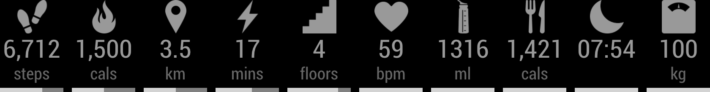

MMM-Fitbit2
===
### _Current Development Status: Work In Progress_

[MagicMirror](https://github.com/MichMich/MagicMirror) Module for displaying Fitbit data, retrieved from Fitbit API ([https://api.fitbit.com](https://dev.fitbit.com/build/reference/web-api/)).



**Note: this module requires that you set up your own "Fitbit app" using a free Fitbit account, in order to generate OAuth 2.0 credentials for accessing your data from Fitbit.**

This extends SVendittelli's original [MMM-fitbit](https://github.com/SVendittelli/MMM-fitbit) module and intends to build on top of the following changes that were incorporated from the efforts of others who forked the original repository:

* adding weight data ([engeld's fork](https://github.com/engeld/MMM-fitbit))
* automatic re-authorisation when tokens have expired ([shbatm's fork](https://github.com/shbatm/MMM-fitbit))

Currently Supported Data
----
* Steps Walked (compared to goal)
* Calories Burned (compared to goal)
* Total Distance Walked (compared to goal)
* \# of Active Minutes (compared to goal)
* \# of Floors Climbed (compared to goal)
* Resting Heart Rate (average for the day)
* Today's Remaining Water Intake (amount consumed subtracted from goal)
* Today's Remaining Calories To Consume (amount consumed subtracted from goal)
* Sleep Time (compared to goal)
* Current Weight (last weigh-in, if within the last 30 days)

Dependencies
---
### Node.js
* [python-shell](https://www.npmjs.com/package/python-shell/v/0.5.0)

### Python 3
* [python-fitbit](https://pypi.org/project/fitbit/0.3.1)

Setup
---
* Go to [Fitbit](https://dev.fitbit.com/apps/new/) and register a new app (sign in with your Fitbit account if needed).
	* Give your app a catchy name and description
	* Your personal website, organisation, and organisation website can be whatever you like
	* Ensure that `OAuth 2.0 Application Type` is set to "Personal"
		* (If you're asked for `OAuth 1.0 Application Type (Deprecated)`, set to "Browser")
	* Callback URL **MUST BE** `http://127.0.0.1:8888/`
	* Give your app read-only permission
	* Note your OAuth 2.0 credentials (you'll need them during setup)
		* "OAuth 2.0 Client ID" --- (this is your `client_id`)
		* "Client (Consumer) Secret" --- (this is your `client_secret`)
			* You can access these again later via [Manage My Apps](https://dev.fitbit.com/apps)

Installation
---
### Steps
```
cd ~/MagicMirror # or whatever your path to Magic Mirror is

cd modules

git clone https://github.com/m-roberts/MMM-Fitbit2

cd MMM-Fitbit2

# Install dependencies
./init.sh

# Repeat for each user/module instance
./auth.sh
```

### `auth.sh`
When you run `auth.sh`, you'll be asked to provide your personal `client_id` and `client_secret` information.

After this, a web browser will launch on your display (even if you ran `auth.sh` over SSH). You'll need to log in using your Fitbit username and password, if you are not logged in already. Make sure to allow access to all options and close the window when instructed.

Once you have done this, you should have a file called `python/tokens-<client_id>.json`. If you have this, you have finished authorisation!

**Note: generating tokens for MMM-Fitbit2 will nullify all previously generated tokens associated with a given `client_id`. If you want to have a Fitbit account working with MMM-Fitbit2 on more than one device, you should copy your tokens file to the same file path, rather than generating new tokens.**

Configuration
---
After installing MMM-Fitbit2, you will need to include the module in your MagicMirror configuration.

Add the example config below to your config file in `~/MagicMirror/config/config.json` (or whatever your path to your Magic Mirror config is), making sure to swap out `client_id` and `client_secret` with your own.

````javascript
		{
			module: "MMM-Fitbit2",
			position: "top_center",
			config: {
				credentials: {
					client_id: "<your client id>",
					client_secret: "<your client secret>",
				},
				resources: [
					"steps",
					"caloriesOut",
					"distance",
					"activeMinutes",
					"floors",
					"restingHeart",
					"water",
					"caloriesIn",
					"sleep",
					"weight"
				],
				update_interval: 10
			}
		},

````

**Finally, (re)start your MagicMirror!**

<!-- Configuration Options
---
This section is yet to be written...
 -->

### Notice
The Fitbit API explains:
> You can make 150 API requests per hour for each user that has authorized your application to access their data. This rate limit is applied when you make an API request using the user's access token.

The default configuration is designed to fetch new Fitbit data every 10 minutes. Depending on the number of resources that are selected, it is likely that multiple API requests are made each time that new Fitbit data is fetched.

This must not be done too often otherwise the rate limit will be exceeded, and Fitbit will not send new tokens and an uncaught exception will be thrown. It is not recommended that a value of less than 10 be used, unless fewer resources are selected. Try setting this to a higher number if you are experiencing problems.

Files
--
### .json (generated)
* `tokens-<client_id>.json` - Access token data generated by OAuth 2.0 credentials. Used to retrieve data from Fitbit API. A new file is generated for each client ID.

### Python (internal)
* `json_handler.py` - Handles JSON, including reading and writing token files.
* `setup_access.py` - Used by `auth.sh` to generate token `.json` files.
* `get_data.py` - Uses `python-fitbit` Python library to get Fitbit API data, using credentials from `tokens-<client_id>.json`. Client credentials and data to fetch is passed in via stdin. Prints out in JSON, to be parsed by `node_helper.js`.

### Javascript (used by MagicMirror)
* `node_helper.js` - Calls `get_data.py`, passes it to `MMM-Fitbit2.js`.
* `MMM-Fitbit2.js` - Receives data from `node_helper.js` and injects it into DOM.

### CSS
* MMM-Fitbit2.css - styling.

TODO
---
See [here](TODO.md).

<!-- Uninstalling/Revoking Access
---
This section is yet to be written...
Delete tokens file. Go to Fitbit dashboard, remove permissions to access data.
 -->
